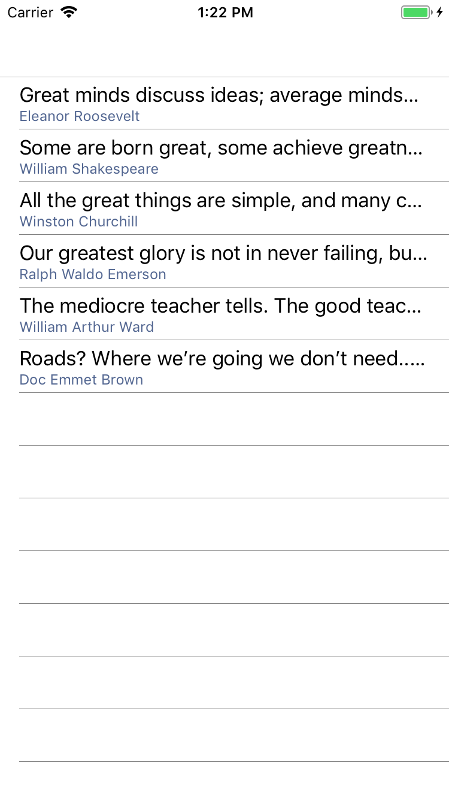
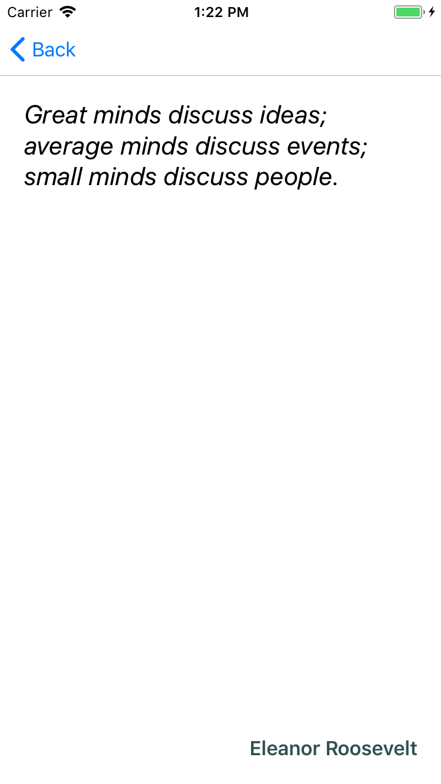

# Lab02: Creating a Xamarin.Forms app
In this lab, you will create your first Xamarin.Forms application, named "Quotes". The app displays famous quotes. In later labs, you will add more features and behaviors to this app, such as a datail view, some nice effects and even a speech engine.

The starter solution for this app already contains some building blocks for providing the quotes to your UI and saving them to disk.

**Prerequisites**: please make sure you have installed all necessary software. [Instructions](https://github.com/XpiritBV/xamarin-hands-on-labs/#getting-started).

## Objectives
- Create a new Xamarin.Forms application that displays famous quotes

## Instructions
### Exercise 1. Getting familiar with the solution
- Open the Starter solution
- Inspect its contents
    - The `QuoteManager` class exposes a `Quotes` collection
    - It also exposes a `Save` method which saves the current collection to local disk. We will use this feature more in later labs.
    - Note how the `QuoteManager` utilizes the `IQuoteLoader` interface for loading and saving quotes on disk. Since file IO is platform specific, there is an implementation of `IQuoteLoader` in each native project.
    - Note that in the `App.xaml.cs` code behind, in the `OnSleep` method, we call the `Save()` method on the `QuoteManager` to persist the data to disk when the app goes into the background. Notice how we can tap into the various application lifecycle events
- Open the `MainPage.xaml` file and inspect its contents
    - It uses a `StackLayout` as a root layout container and displays a `Label` which is centered horizontally and vertically on the screen.

### Exercise 2. Displaying a ListView

We want our `MainPage` to look like this (iOS screenshot):



1. First, set the `BindingContext` of this page to the `QuoteManager` singleton instance, so we can databind the controls in this page to the data. Open `MainPage.xaml.cs` and find the class constructor. Before the call to `InitializeComponent()`, add the following:
    ```csharp
    BindingContext = QuoteManager.Instance;
    ```
2. Replace the `StackLayout` with a `ListView`, making the `ListView` the root view of the `MainPage` content page. A `ListView` will automatically take up all the available space in its parent layout container by default.
3. Bind the `ItemsSource` property to the `Quotes` collection of the `BindingContext` of this page

    ```xml
    <ListView ItemsSource="{Binding Quotes}"> ... </ListView>
    ```

4. Run the app. Notice that the list displays a number of items, but they only show the name of the `Quote` class. By default, `ListView` performs a `.ToList()` on each item in the list and displays the string value in each cell. Let's make sure the app displays the actual quote and its author. A standard Xamarin.Forms `TextCell` can do this job for us.
5. Add an `ItemTemplate` to the `ListView`, and set the `DataTemplate` to be a `TextCell`. Bind the `TextCell`'s `Text` property to the `QuoteText` and the `Detail` property to the `Author` of the `Quote` object.
    ```xml
    <ListView ItemsSource="{Binding Quotes}">
        <ListView.ItemTemplate>
            <DataTemlate>
                <TextCell Text="{Binding QuoteText}" Detail="{Binding Author}" />
            </DataTemplate>
        </ListView.ItemTemplate>
    </ListView>
    ```
6. Run the app and notice that it looks like the screenshot above.

Well done!

### Exercise 3. Adding a detail page and navigation
Let's add a little bit more behavior to this app. When you click an item in the list, we want to show a detail page that displays the quote in a large font and the author, something like this:



1. First we need to add a navigation context to this app so that we can navigate between pages. Go to `App.xaml.cs` and locate the class constructor. Find the line that says:
    ```csharp
    MainPage = new Quotes.MainPage();
    ```
2. All we need to do here is wrap a `NavigationPage` around our `MainPage` to serve as the host for the navigation framework. Change the line to:
    ```csharp
    MainPage = new NavigationPage(new Quotes.MainPage());
    ```
4. Add a new XAML page to the project and name it `QuoteDetailPage`.
5. Inspect its layout and change it to look like the screenshot. How would you build up this page? Is it a `ListView`? Or perhaps a `Grid` or `StackLayout`? How many labels are on there? Experiment with the different values of `HorizontalOptions`, `VerticalOptions`, `FontSize`, `FontAttributes` and `HorizontalTextAlignment` to achieve a this look. You can peek in the `Completed` solution to see the solution. _Hint: you can do it with a `StackLayout` and two `Label`s_.
6. The `QuoteDetailPage` also needs a `BindingContext` to facilitate databinding of the `Label`s. In the code behind in `QuoteDetailPage.xaml.cs`, find the class constructor. We're going to pass in the `Quote` as a constructor parameter and assign it to the `BindingContext`. Change the constructor to this:
```csharp
    public QuoteDetailPage(Quote quote)
    {
        BindingContext = quote;
		InitializeComponent();
    }
```
6. Go back to `MainPage.xaml`; we're going to add behavior to this page to initiate navigation. Add a handler to the `ItemSelected` event of the `ListView`.
```xml
    <ListView ItemSelected="ListView_ItemSelected" ...>
        ...
    </ListView>
```
7. Go into the `MainPage.xaml.cs` code behind to implement the handler. It should do the following:
    - Deselect the selected item, so that the selected row doesn't stay selected after navigating back to the list. This is a common practice with `ListView`.
    - Initiate the navigation to the `QuoteDetailPage`.
    - The handler should look like this:
    ```csharp
    private async void ListView_ItemSelected(object sender, SelectedItemChangedEventArgs e)
    {
        ((ListView)sender).SelectedItem = null; // deselect current item
        if (e.SelectedItem != null)
        {
            await Navigation.PushAsync(new QuoteDetailPage(e.SelectedItem as Quote));
        }
    }
    ```
    - Notice that this event handler receives a `SelectedItemChangedEventArgs` parameter that gives you the item that the user clicked/touched in the `ListView`.
    - Notice also that the method is marked `async` because it `await`s the call to `Navigation.PushAsync(...)`. The navigation framework is `async` and it is good practice to always `await` these methods. _For more info, see the [tips on using `async` and `await`](https://github.com/XpiritBV/xamarin-hands-on-labs#async--await)_.
8. Run the application. Notice that when you click an item in the list, the app navigates to the detail page.

In our next labs, we're going to add more behavior to this app.

### Exercise 4. Enable XAML Compilation
In this exercise, we will explore the different options for XAML compilation.

## Instructions
1. Enable XAML Compilation for the entire shared project named `Quotes`. We do this by adding an assembly level attribute. Usually, this is done in the file named `AssemblyInfo.cs` (under `Properties`):

```csharp
[assembly: Xamarin.Forms.Xaml.XamlCompilation(Xamarin.Forms.Xaml.XamlCompilationOptions.Compile)]
```
2. Open one of the pages and "sabotage" the XAML, e.g. by miss-spelling an attribute name or removing a closing XML tag.
3. Compile the project and notice that the erros introduced in the broken XAML page show up in the **Build Errors** list.
4. Undo the changes to restore the XAML page back to a working state.

We can also enable or disable XAML compilation on a per page level.

5. Open the `C#` code behind of one of the pages. Add an attribute above the `class` declaration:

```csharp
[Xamarin.Forms.Xaml.XamlCompilation(Xamarin.Forms.Xaml.XamlCompilationOptions.Skip)]
```

Notice that this is **not** an `assembly` level attribute, so it only applies to this particular page.

6. Break the XAML for this page again as in step 2 and notice that no build errors show up for this page. These errors will now show up at runtime, in essence crashing the app due to invalid XAML.

This completes Lab02. Well done!

Next up: [Lab03](../Lab03/readme.md)
